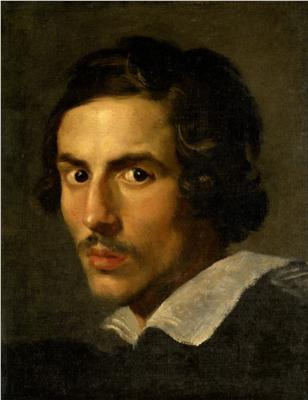

% Historia del arte: Arte Barroco
% Aitana García
% Mayo 2023

# Introducción

## Presentación del microcurso

Este microcurso supone un abordamiento al arte barroco en su vertiente arquitectónica, escultórica y pictórica. Primero se introducirá el contexto histórico y sociocultural del [Barroco](https://es.wikipedia.org/wiki/Barroco) y después se estudiarán las características, los artistas y algunas obras relevantes de cada una de estas formas de arte: arquitectura, escultura y pintura.

## Índice

1. Introducción

2. La arquitectura

  2.1. Características generales

  2.2. La arquitectura italiana

    2.2.1. Carlo Maderno

    2.2.2. Bernini

    2.2.3. Borromini

  2.3. La arquitectura en Francia

## Índice

3. La escultura 

  3.1. Introducción

    3.1.1. Características de la escultura barroca

    3.1.2. Etapas de la escultura barroca

  3.2. Bernini

    3.2.1. Rasgos

    3.2.2. Obras

## Índice

4. La pintura

  4.1. Rasgos generales

  4.2. La pintura italiana

    4.2.1 El naturalismo de Caravaggio

    4.2.2. El clasicismo de Annibale Carracci

    4.2.3. El barroco decorativo

  4.3. La pintura flamenca

## Índice

  4.4. La pintura holandesa

    4.4.1. Frans Hals

    4.4.2. Rembrandt

    4.4.3. Vermeer

## Algunos de los artistas que serán estudiados:

::: {.columns}

:::: {.column width="50%"}

{ width=25% }

::::

:::: {.column width="50%"}

{ width=20% }

::::

:::

# Objetivos y competencias

## Objetivos

### El curso tiene los siguientes objetivos:

* Proporcionar conocimientos teóricos generales sobre la arquitectura, escultura y pintura del Barroco, así como los artistas más relevantes
* Ofrecer una contextualización cultural y temporal de estilos, obras y artistas
* Enseñar a analizar y comentar obras de arte

## Competencias

* Reconocimiento y análisis de las diversas manifestaciones estéticas y sus elementos 
* Empleo básico de los lenguajes artísticos y del vocabulario de la disciplina
* Comprensión contextualizada de las creaciones culturales como reflejo de la sociedad que las ha generado

# Método de evaluación

## Trabajo final

La evaluación se realizará mediante un trabajo final que consistirá en el análisis y comentario de tres obras de arte barrocas (una arquitectónica, otra escultórica y otra pictórica) a elección del alumno. Los detalles de la tarea se facilitarán en su correspondiente documento.

# Bibliografía

## Bibliografía

*Arte Barroco*. (2015, 2 diciembre). Historia del arte en resumen. [https://historiadelarteen.com/2015/12/02/arte-barroco/](https://historiadelarteen.com/2015/12/02/arte-barroco/)

De La Garma, D. (s. f.). *Barroco en Europa*. [https://historiadelarteen.com/2015/12/02/arte-barroco/](https://www.arteespana.com/barroco.htm)